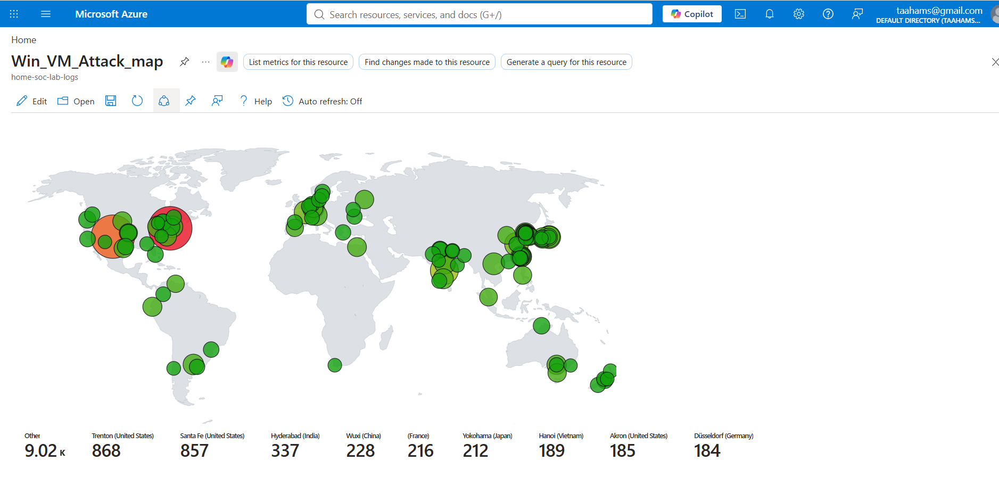
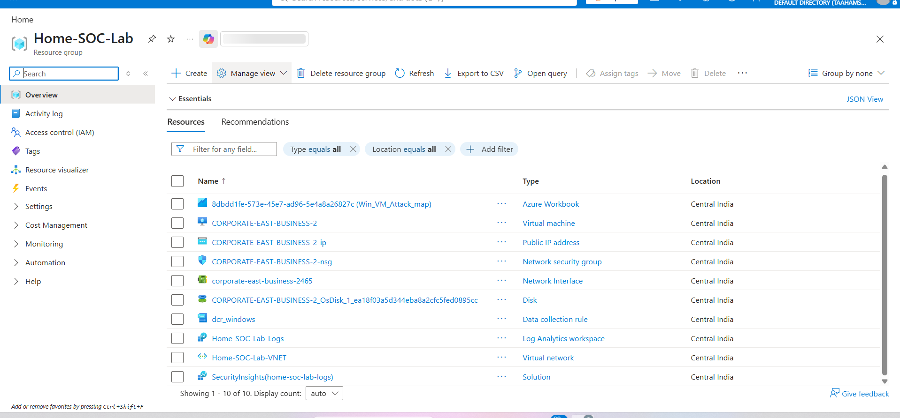
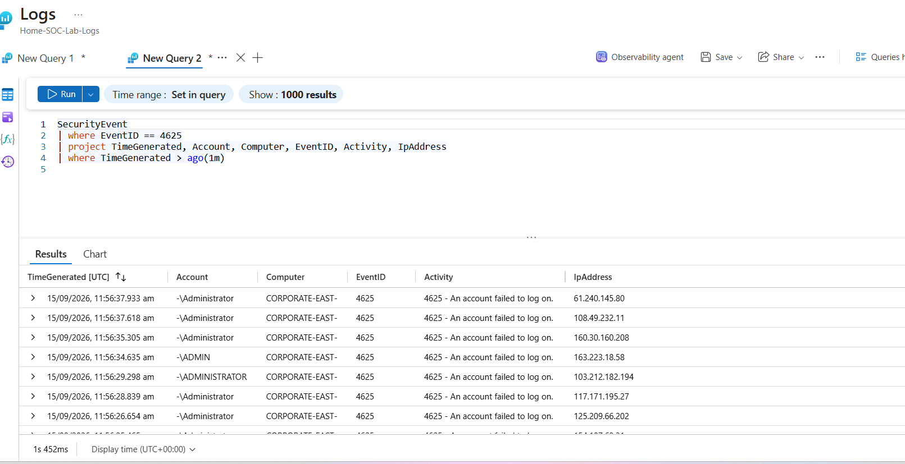
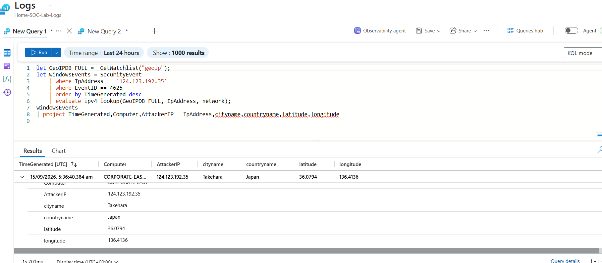
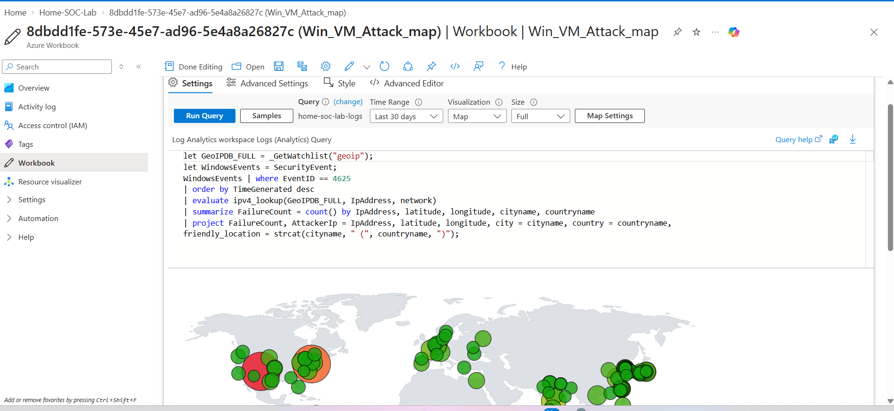

# Azure Honeypot SOC Lab: Mapping Real-World Attacks with Microsoft Sentinel



## 📌 Project Overview

This project demonstrates the deployment of a deliberately vulnerable Windows 11 Virtual Machine on Microsoft Azure to serve as a honeypot. The objective was to observe, capture, and analyze real-world cyber attacks using **Microsoft Sentinel**, **Azure Monitor Agent**, and **Log Analytics Workspaces**.

Over a several-hour window, the VM was targeted by thousands of brute-force attacks from around the globe. This repository documents the setup, the KQL queries used to extract and enrich the data, and the visualization of attacker geolocations.

---

## 🎯 Objectives

- Deploy a Windows VM on Azure with no firewall restrictions (a "honeypot").
- Configure Azure Monitor Agent and Microsoft Sentinel to ingest Windows Security Events.
- Use KQL (Kusto Query Language) to extract failed login attempts (Event ID 4625).
- Enrich IP addresses with geographic data using a Sentinel Watchlist.
- Visualize attack origins on a world map using Azure Workbooks.

---

## 🏗️ Architecture

The entire lab is deployed within a single Azure Resource Group named `Home-SOC-Lab`.



| Component | Resource Name | Details |
| :--- | :--- | :--- |
| **Resource Group** | `Home-SOC-Lab` | Central container for all lab resources. |
| **Virtual Machine** | `COPORATE-EAST-BUSINESS-2` | Windows 11 Pro, Standard D2ls v6 (2 vCPUs, 4 GiB RAM) |
| **Network Security Group** | `COPORATE-EAST-BUSINESS-2-nsg` | Configured to allow *all* inbound traffic (honeypot). |
| **Log Analytics Workspace**| `Home-SOC-Lab-Logs` | Central repository for all ingested security logs. |
| **Data Collection Rule** | `dcr_windows` | Defines which Windows Event logs to collect (Event ID 4625). |
| **Azure Workbook** | `Win_VM_Attack_map` | Custom visualization dashboard for the attack map. |
| **Sentinel Solution** | `SecurityInsights` | Microsoft Sentinel SIEM enabled on the workspace. |

---

## ⚙️ Setup & Configuration

### 1. Virtual Machine Deployment
- Deployed a **Windows 11 Pro** VM in Azure.
- **Name**: `COPORATE-EAST-BUSINESS` (to appear as a corporate machine to attackers).
- **Size**: Standard D2ls v6 (2 vCPUs, 4 GiB memory).

### 2. Network Security Group (NSG) Configuration
To make the VM a honeypot, all default inbound security rules were **deleted**. A new high-priority rule was created:

| Priority | Name | Port | Protocol | Source | Destination | Action |
| :--- | :--- | :--- | :--- | :--- | :--- | :--- |
| 100 | **DANGER_AllowAll** | Any | Any | Any | Any | Allow |

This allowed **all traffic** from the public internet to reach the VM.

### 3. Windows Defender Firewall
Logged into the VM and **turned off Windows Defender Firewall** completely across all profiles (Domain, Private, Public). This ensured that no internal filtering blocked incoming attacks.

### 4. Log Analytics & Sentinel
- Created a Log Analytics Workspace (`Home-SOC-Lab-Logs`).
- Enabled **Microsoft Sentinel** on the workspace.
- Installed the **Azure Monitor Agent (AMA)** on the VM via the Azure portal.
- Created a **Data Collection Rule (DCR)** (`dcr_windows`) to collect **Windows Security Events** (specifically Event ID 4625 - Failed Logon).
- Verified that logs were flowing into the `SecurityEvent` table.

### 5. GeoIP Watchlist
Uploaded a CSV file to Sentinel as a Watchlist named `geoip`. The CSV contained:
- `network` (IP range in CIDR notation)
- `latitude`
- `longitude`
- `cityname`
- `countryname`

This watchlist was used to enrich raw IP addresses with geographic metadata. The full watchlist (~54,800 IPv4 `/16` ranges) is included in [`watchlist/geoip.csv`](watchlist/geoip.csv).

---

## 🔍 KQL Queries

### 1. View Raw Failed Login Attempts

This query filters the `SecurityEvent` table for failed logins (Event ID 4625) to observe the raw attack traffic.



```kql
SecurityEvent
| where EventID == 4625
| project TimeGenerated, Account, Computer, EventID, Activity, IpAddress
| where TimeGenerated > ago(1m)
```

### 2. Enrich IPs with Geolocation

This query uses the `ipv4_lookup` function alongside the `geoip` Watchlist to enrich a specific attacker's IP address with geographic data.



```kql
let GeoIPDB_FULL = _GetWatchlist("geoip");
let WindowsEvents = SecurityEvent
    | where IpAddress == '124.123.192.35'
    | where EventID == 4625
    | order by TimeGenerated desc
    | evaluate ipv4_lookup(GeoIPDB_FULL, IpAddress, network);
WindowsEvents
| project TimeGenerated, Computer, AttackerIP = IpAddress, cityname, countryname, latitude, longitude
```

### 3. Aggregate Attacks by Location (Used for Map)

This query aggregates all failed login attempts by IP address and joins them with the Watchlist to generate the data used in the map visualization.



```kql
let GeoIPDB_FULL = _GetWatchlist("geoip");
let WindowsEvents = SecurityEvent;
WindowsEvents | where EventID == 4625
| order by TimeGenerated desc
| evaluate ipv4_lookup(GeoIPDB_FULL, IpAddress, network)
| summarize FailureCount = count() by IpAddress, latitude, longitude, cityname, countryname
| project FailureCount, AttackerIp = IpAddress, latitude, longitude, city = cityname, country = countryname,
friendly_location = strcat(cityname, " (", countryname, ")");
```

---

## 🗺️ Visualization: Attack Map

The aggregated data was visualized using an **Azure Workbook** with a **Map** visualization.

### Map Settings

| Setting | Value |
| :--- | :--- |
| **Visualization** | Map |
| **Location Info** | LatLong |
| **Latitude** | `latitude` |
| **Longitude** | `longitude` |
| **Size Settings** | `FailureCount` |
| **Size Aggregation** | Sum |
| **Color Settings** | Heatmap (Green to Red) |
| **Label** | `friendly_location` |

### Map JSON (For Import)

```json
{
  "type": 3,
  "content": {
    "version": "KqlItem/1.0",
    "query": "let GeoIPDB_FULL = _GetWatchlist(\"geoip\");\nlet WindowsEvents = SecurityEvent;\nWindowsEvents | where EventID == 4625\n| order by TimeGenerated desc\n| evaluate ipv4_lookup(GeoIPDB_FULL, IpAddress, network)\n| summarize FailureCount = count() by IpAddress, latitude, longitude, cityname, countryname\n| project FailureCount, AttackerIp = IpAddress, latitude, longitude, city = cityname, country = countryname,\nfriendly_location = strcat(cityname, \" (\", countryname, \")\");",
    "size": 3,
    "timeContext": {
      "durationMs": 2592000000
    },
    "queryType": 0,
    "resourceType": "microsoft.operationalinsights/workspaces",
    "visualization": "map",
    "mapSettings": {
      "locInfo": "LatLong",
      "locInfoColumn": "countryname",
      "latitude": "latitude",
      "longitude": "longitude",
      "sizeSettings": "FailureCount",
      "sizeAggregation": "Sum",
      "opacity": 0.8,
      "labelSettings": "friendly_location",
      "legendMetric": "FailureCount",
      "legendAggregation": "Sum",
      "itemColorSettings": {
        "nodeColorField": "FailureCount",
        "colorAggregation": "Sum",
        "type": "heatmap",
        "heatmapPalette": "greenRed"
      }
    }
  },
  "name": "query - 0"
}
```

---

## 📊 Findings

### Top Attack Sources (by Failed Login Attempts)

| Location | Country | Failed Attempts |
| :--- | :--- | :--- |
| Trenton | United States | 868 |
| Santa Fe | United States | 857 |
| Hyderabad | India | 337 |
| Wuxi | China | 228 |
| (Unknown) | France | 216 |
| Yokohama | Japan | 212 |
| Hanoi | Vietnam | 189 |
| Akron | United States | 185 |
| Düsseldorf | Germany | 184 |
| **Other** | — | **9,020+** |

### Key Observations

1. **Speed of Compromise**: The VM was targeted within **minutes** of being exposed. Automated bots scan the entire IPv4 space continuously.
2. **Most Common Username**: `Administrator` was the most frequently attempted username.
3. **Attack Type**: All attacks were **brute-force RDP login attempts** (Event ID 4625).
4. **Geographic Distribution**: Attacks originated from **every continent**, with the highest volumes from the United States, India, and China.
5. **No Firewall = Instant Target**: Removing all firewall rules resulted in thousands of attacks within hours.

---

## 🛡️ Mitigation (What I Would Do Next)

This lab was intentionally left vulnerable to collect data. In a real production environment, the following mitigations would be applied **immediately** — see [`mitigation/nsg-rules.md`](mitigation/nsg-rules.md) for details.

| Mitigation | Description |
| :--- | :--- |
| **Restrict NSG Rules** | Allow RDP/SSH only from specific trusted IP addresses. |
| **Just-In-Time (JIT) VM Access** | Enable JIT to open ports only when needed, for a limited time. |
| **Enable MFA** | Require Multi-Factor Authentication for all administrative access. |
| **Use Bastion Host** | Deploy Azure Bastion to avoid exposing RDP/SSH to the public internet. |
| **Enable Defender for Cloud** | Turn on Defender for Servers for threat detection and vulnerability assessment. |
| **Strong Password Policy** | Enforce complex passwords and account lockout policies. |
| **Sentinel Analytics Rules** | Create alerts for repeated failed login attempts and auto-block IPs. |

---

## 📁 Repository Structure

```
Azure-Honeypot-SOC-Lab/
├── README.md                    # This file
├── images/
│   ├── attack-map.png           # Screenshot of the final Azure Workbook map
│   ├── resource-group.png       # Screenshot of the Azure Resource Group overview
│   ├── workbook-map-query.png   # Screenshot of the Workbook query editor + map
│   ├── raw-security-logs.png    # Screenshot of raw Event ID 4625 logs
│   └── enriched-logs-geo.png    # Screenshot of enriched logs with GeoIP data
├── queries/
│   ├── 01-raw-failed-logins.kql
│   ├── 02-enrich-single-ip.kql
│   └── 03-aggregate-attack-map.kql
├── watchlist/
│   └── geoip.csv                # Full GeoIP watchlist used by the Sentinel watchlist
└── mitigation/
    └── nsg-rules.md             # Explanation of how to secure the VM
```

---

## 🧠 Lessons Learned

- **The internet is hostile.** An unprotected VM is attacked within minutes.
- **Logging is essential.** Without Sentinel and Log Analytics, these attacks would have gone unnoticed.
- **KQL is powerful.** Enriching raw logs with Watchlists turns meaningless IPs into actionable intelligence.
- **Visualization tells a story.** A map is far more impactful than a table of numbers.
- **Security is not optional.** Firewalls, NSG rules, and MFA are the bare minimum for any internet-facing resource.

---

## 🔗 References

- [Microsoft Sentinel Documentation](https://learn.microsoft.com/en-us/azure/sentinel/)
- [Azure Monitor Agent](https://learn.microsoft.com/en-us/azure/azure-monitor/agents/azure-monitor-agent-overview)
- [KQL Reference](https://learn.microsoft.com/en-us/azure/data-explorer/kusto/query/)
- [Sentinel Watchlists](https://learn.microsoft.com/en-us/azure/sentinel/watchlists)

---

## 👤 Author

**Taaha Siddiqui Mohammed**
- LinkedIn: [linkedin.com/in/taahams](https://www.linkedin.com/in/taahams/)
- GitHub: [github.com/taahams](https://github.com/taahams)

---

## ⚠️ Disclaimer

This project was conducted in a controlled lab environment for educational purposes only. The VM was intentionally left vulnerable to collect attack data and was decommissioned after the experiment. Do not attempt to replicate this on any system you do not own or have explicit permission to test.
